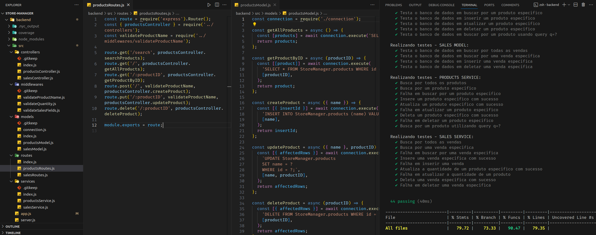

# README: Store Manager



## Project Description

This project is a RESTful API developed using a layered architecture, allowing for the creation, viewing, deletion, and updating of products and sales. In addition to the application, unit tests were developed to cover 90% of the code lines and potential mutations using Stryker.

### Technologies

- LINUX
- VSCODE
- NODE.JS
- MYSQL
- JAVASCRIPT
- MOCHA
- STRYKER
- LINT

### What I Learned

- How to make a Node application communicate with a database.
- How to structure code using layers: model, service, controller.
- How to create routes in a separate folder and connect them to controllers.
- How to perform unit tests for all layers.

## How to Run the Project

1. Clone the repository:

   ```bash
   git clone https://github.com/feduarte-dev/store-manager
   ```

2. Navigate to the project directory:

   ```bash
   cd your-repository
   ```

3. Install dependencies inside backend folder:

   ```bash
   cd backend
   npm install
   ```

4. Initiate the containers

   ```bash
   docker-compose up -d
   docker logs -n 10 -f store_manage
   ```

5. If you want to run tests, run another terminal 

   ```bash
   cd backend
   npm run test:mocha 
   npm run test:coverage
   npm run test:mutation
   ```

## Contributions

[Felipe](https://www.linkedin.com/in/feduarte-dev/) - /controller - /middlewares - /routes - /models - /services - /tests


[Trybe](https://www.betrybe.com/) - Everything else
